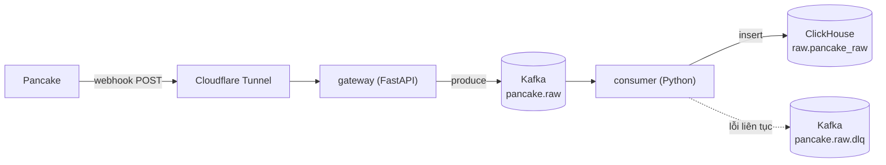

# Pancake Streaming Ingestion

Streaming ingestion pipeline nhận webhook từ [Pancake](https://pancake.vn) (nền tảng quản lý hội thoại đã kết nối Facebook Page / Zalo OA), đẩy qua Kafka, và lưu vào ClickHouse để phân tích. Project portfolio cá nhân, tự triển khai từ đầu — ưu tiên thể hiện kỹ năng engineering (xử lý lỗi, retry, dead-letter queue, batch processing) thay vì dùng managed connector có sẵn.

## Kiến trúc



- **`gateway`** — FastAPI service. Nhận webhook POST, verify secret token nhúng trong URL, parse JSON, produce vào Kafka. Trả `200` ngay lập tức, không chờ các bước sau — giữ webhook luôn phản hồi nhanh, tránh bị Pancake tự động suspend khi lỗi/timeout.
- **`consumer`** — Python service riêng, độc lập với gateway. Đọc Kafka theo batch (gom tối đa `BATCH_SIZE` message hoặc mỗi `BATCH_FLUSH_SECONDS` giây), insert vào ClickHouse, commit offset sau khi ghi thành công. Lỗi ghi liên tục (retry 3 lần) → đẩy sang topic dead-letter queue thay vì kẹt/crash.

`gateway` và `consumer` là 2 process/container độc lập, cố tình tách rời qua Kafka: nếu ClickHouse chậm/chết, `gateway` vẫn tiếp tục nhận và trả lời webhook bình thường — không ảnh hưởng lẫn nhau.

## Tech stack

| Thành phần | Công nghệ |
|---|---|
| Webhook gateway | FastAPI + Uvicorn |
| Message broker | Apache Kafka (KRaft mode, không cần Zookeeper) qua `confluent-kafka` |
| Data warehouse | ClickHouse qua `clickhouse-connect` |
| Orchestration local | Docker Compose |
| Public exposure | Cloudflare Tunnel (không cần port-forwarding/mở port trên router) |
| Debug UI | Kafka UI (`provectuslabs/kafka-ui`) |

## Chạy thử

### Yêu cầu
- Docker + Docker Compose
- (tuỳ chọn) [`cloudflared`](https://developers.cloudflare.com/cloudflare-one/connections/connect-apps) nếu muốn expose ra internet thật

### Setup

```bash
cp .env.example .env
# Sửa PANCAKE_WEBHOOK_SECRET trong .env — sinh 1 giá trị random:
openssl rand -hex 24

docker compose up -d --build
```

### Test nhanh bằng curl

```bash
SECRET=$(grep PANCAKE_WEBHOOK_SECRET .env | cut -d= -f2)

curl -X POST "http://localhost:8000/webhooks/pancake/$SECRET" \
  -H "Content-Type: application/json" \
  -d '{"type":"message","conversation_id":"demo-1","content":"xin chao"}'
```

Theo dõi luồng data qua log hoặc Kafka UI (`http://localhost:8080`):

```bash
docker logs -f gateway     # thấy request nhận + produce Kafka
docker logs -f consumer    # thấy batch insert ClickHouse
```

### Expose ra internet (tuỳ chọn, để đăng ký webhook thật với Pancake)

```bash
cloudflared tunnel --url http://localhost:8000
```

In ra 1 URL public dạng `https://xxx.trycloudflare.com` — dán vào Pancake dashboard kèm secret token ở cuối path.

## Trạng thái hiện tại

| Milestone | Trạng thái |
|---|---|
| Hạ tầng (Kafka, ClickHouse, Kafka UI, Cloudflare Tunnel) | ✅ Xong |
| Gateway — nhận webhook, verify, produce Kafka | ✅ Xong, đã test thật |
| Consumer — batch insert ClickHouse, DLQ, retry | ✅ Xong, đã test cả path lỗi (ClickHouse down → DLQ → tự phục hồi) |
| Bảng ClickHouse | ✅ Xong (dạng raw JSON chung, chưa tách theo loại event — chờ payload thật từ Pancake để biết field phân loại) |
| Đăng ký webhook thật với Pancake | ⛔ Đang chờ — cần Pancake support bật tính năng cho page (ngoài phạm vi code) |

## Quyết định thiết kế đáng chú ý

- **Kafka đứng giữa gateway và consumer**: không phải "cho oai" — nếu gateway ghi thẳng ClickHouse, ClickHouse chậm/chết sẽ kéo theo cả webhook chết theo, dễ dính ngưỡng auto-suspend của Pancake (>80% lỗi trong 30 phút). Kafka làm bộ đệm, tách 2 tốc độ.
- **Tự viết consumer thay vì dùng ClickHouse Kafka Engine hoặc Kafka Connect connector có sẵn**: đánh đổi tốc độ triển khai lấy việc tự tay implement batch/retry/DLQ — mục tiêu chính là luyện kỹ năng, không phải launch nhanh nhất có thể.
- **At-least-once, không phải exactly-once**: commit offset chỉ sau khi ghi ClickHouse thành công (hoặc sau khi đẩy DLQ) — chấp nhận khả năng xử lý trùng nếu crash giữa chừng, không chấp nhận mất dữ liệu.
